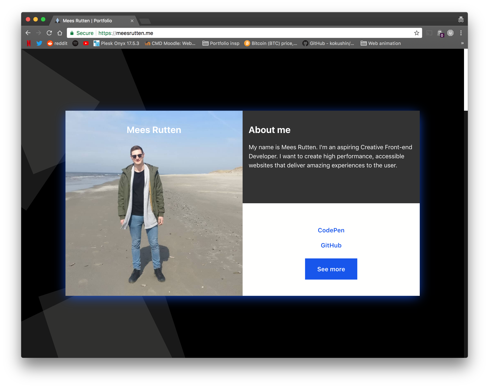

# The design of my portfolio

- **[About this project](#about-this-project)**  
- **[Design](#design)**  
- **[Sketches and content inventarisation](#sketches-and-content-inventarisation)**  
- **[Principles of User Interface Design](#principles-of-user-interface-design)**  
- **[Feedback by Mo Mulazada](#feedback-by-mo-mulazada)**  
- **[Fixes based on feedback by Mo](#fixes-based-on-feedback-by-mo)**  
- **[Feedback by Georgemain Laurens](#feedback-by-georgemain-laurens)**  
- **[Fixes based on feedback by Georgemain](#fixes-based-on-feedback-by-georgemain)**  
- **[Animation](#Animation)**  
- **[Accessibility and animation](#accessibility-and-animation)**  
- **[What I learned from Larissa](#what-i-learned-from-larissa)**  
	- **[Internet usage of a nearly blind person](#internet-usage-of-a-nearly-blind-person)**  
	- **[Testing my portfolio with Larissa](#testing-my-portfolio-with-larissa)**  
- **[User story](#user-story)**  
	- **[John the CEO](#john-the-ceo)**  
	- **[Larissa](#larissa)**  
- **[To do and future](#to-do-and-future)**  

## About this project
This project is my personal portfolio of project i'm proud about and things I did.
I'm focussing **heavily** on animation, which should have been clear when you saw the site ;).

## Design
This design features an interactive card design.\
The most important aspect is the 3D depth of the cards.\
I've created a background of rectangles which overlay and should increase depth of the cards.\
On first load, the zero state, the user will see an animation of the card to give awareness of it's interactiveness.\
If the user hovers over a card he will see it moving in depth, this effect should give the user a clue that there is more content behind or within the card.\
When scrolling the cards will change in depth for the same effect named above.\
When interacting with the primary action, the card will flip or fold and reveal it's contents.\

## Sketches and content inventarisation

Card sorting for content inventarisation

First sketch

Sketch of my cards

Sketch of my article page

Sketch of the background

## Principles of User Interface Design:

I followed certain principles of UIDesign by Joshua Porter.\

2. Interfaces exist to enable interaction
6. One primary action per screen
	- My primary actions are per _card_ instead of screen.
7. Keep secondary action secondary
	- I kept links to external websites a blue on white color while relative links get a button type feeling
8. Provide a natural next step
	- Every screen has buttons to other pages
11. Strong visual hierarchies work best
	- Titles with a paragraph or a list per title for hierarchy.
	- I use animation to visualize the hierarchy
12. Smart organization reduces cognitive load
	- The cards with obvious color differences should keep things organised.

## Feedback by Mo Mulazada:
- Fix typography, placement
- a blue-ish green on white contrast is not sufficient
- 'Cool scrollbar'
- 'What is this website?'
- Concept isn't clear enough

### Fixes based on feedback by Mo
- Changed typography to a system font
- I changed the link color which now scores a contrast ratio of 6.14
	- The links are also made **bold** for better readability
- I added 'Portfolio' in the title of the website.

Version 1.0.0 of my portfolio

## Feedback by Georgemain Laurens:
- The title on the image is off, you could change that with the title on the right top block
- The hover effect on your button is feeling cheapish
- There is a disconnect between your blue drop-shadow and the rest of the content, especially the gray block
- 'See More' button seems to be too big, and align the links on the left
- You could add icons to the links
- The 'i used:' list is getting cut off and has too little space
- 'See more' is your main action, keep it's priority highest

### Fixes based on feedback by Georgemain
- I changed the title to be on the right block
- I changed the color of the dark gray block to the same white color of the block underneath
	> I have more space for content now :)
- Added some icons and screen-reader text in the links
- Changed styling of the 'See more' link
- Aligned the titles with the images

Version 1.1.0 of my portfolio

Version 1.2.0 of my portfolio, probably the final version

Version 1.2.0 of my portfolio article page, probably the final version

## Animation
For animation I used `TweenMax` and `TimelineMax` by GreenSock.\
Animations play when the user first enters the website and leaves the website to a new page.\
For the card animation I used `transform: rotate(X, Y)` and the CSS property `perspective`.\

## Accessibility and animation
To make animations accessible for (near)blind users I did a lot of research.\
[Aria Live Regions | MDN](https://developer.mozilla.org/en-US/docs/Web/Accessibility/ARIA/ARIA_Live_Regions)
`aria-live` helped a lot. By using `polite` or `rude` as values you are able to let a user with a screenreader know that certain elements are made visible.

[Aria Busy](https://accessibilityresources.org/aria-busy)
With `aria-busy` it is made possible to let a screenreader know that an element is currently loading or that it's contents are not yet visible.
1. First you set `aria-busy="true"` on the running animation
2. When the animation is finished you toggle it to `aria-busy="false"`
3. Because of `aria-live="polite"` the content is now accessible

I tested the possibilities with Larissa, a woman who can currently see just 2%.\
After 1.2seconds after navigating, she was informed about the animation with a descriptive text with `aria-live="rude"` which is dynamically added to the DOM.\
> I chose for this timing because screenreaders often tell the user about a lot of meta-data of the website.
She chose to ignore the text altogether; which is fine and she wasn't bothered by it.\
After that she navigated to the now visible content that was made visible by animation. \

> Before these tags animation were often a pain in the ass for (near)blind users as they usually make pages feel like they are broken.

## What I learned from Larissa
### Internet usage of a nearly blind person
- When navigating she first looks at all the **headings** and **links**.
	- After that she searches for **lists** because navigation is often put in those.
- The use of patterns are recommended.
- She hates `<iframe>` elements because when using `tab` you often get stuck
- Never use links with just an icon in them, always add a description for the links list.
- Don't swap text, as the screenreader starts reading the new text immediately (looking at you, carroussels.)
	- You could still do it, just add a pause functionality
- If loading takes a while give some feedback or make the loader focussable 

### Testing my portfolio with Larissa
[Link to video](https://youtu.be/HjDgq6Cxv90) \
I asked her if she could:
1. Make an inventorisation of the website and explain to me how she thinks the structure works
2. Navigate to a page and read it's contents

Findings:
- URLs were not descriptive enough
	> In the links I added a `` with more descriptive text and added my `screen-reader-only` class to it.
- Can't find text 'about Mees'
	> This seemed to have happened because I didn't change the `aria-busy="true"` attribute to `false`
- Aria-labels seem to break on `figure` elements
	> Some labels were removed
- Article pages are fine
	> ;D

My observations:
- Larissa did not seem bothered by the animation
	> After I toggled the `aria-busy` attribute
- She didn't feel like hearing the 'story-told' animation

## User story
This website was an exercise for my study.
The user story I wrote is for a man at a Creative Digital company who sees applications and hires Front-end Developers and interns.

### John the CEO
As a manager of my team, I want to see interesting and creative websites, research and solutions by people who want to work at my company. I want to see work of students who can make websites feel alive and well. The website should radiate a feeling that I as a viewer can emerge in and not feel bothered by it.

### Larissa 
As a (near)blind user, I want to be able to use the website functionalities as fast and correct as possible with a screenreader and keyboard navigation so that I can enjoy it's purpose and use the web without struggling

## To do and future
1. Make a mobile version
2. Increase the performance on browsers like Firefox, Safari and Edge
3. Add a serviceworker
4. Add progressive image loading
5. Reduce first load heavily